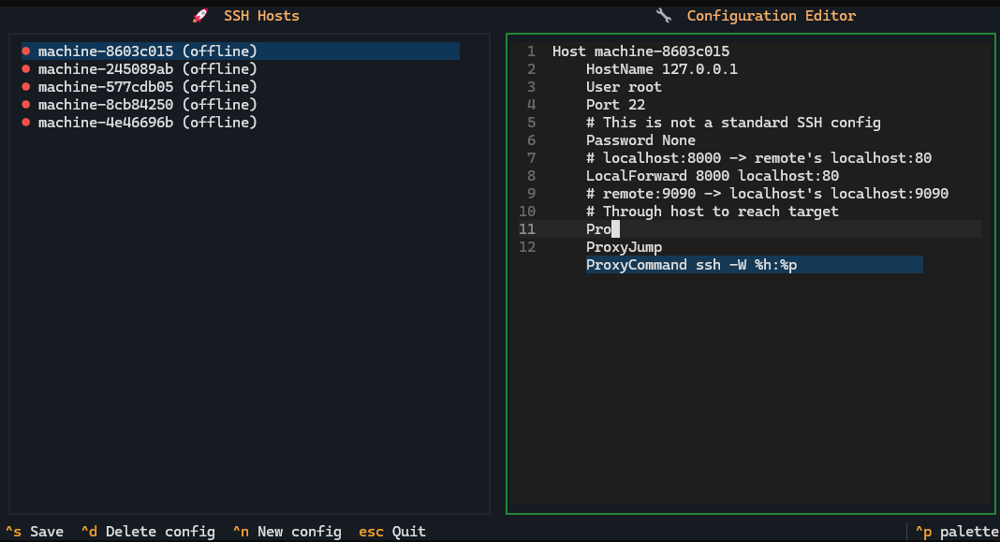
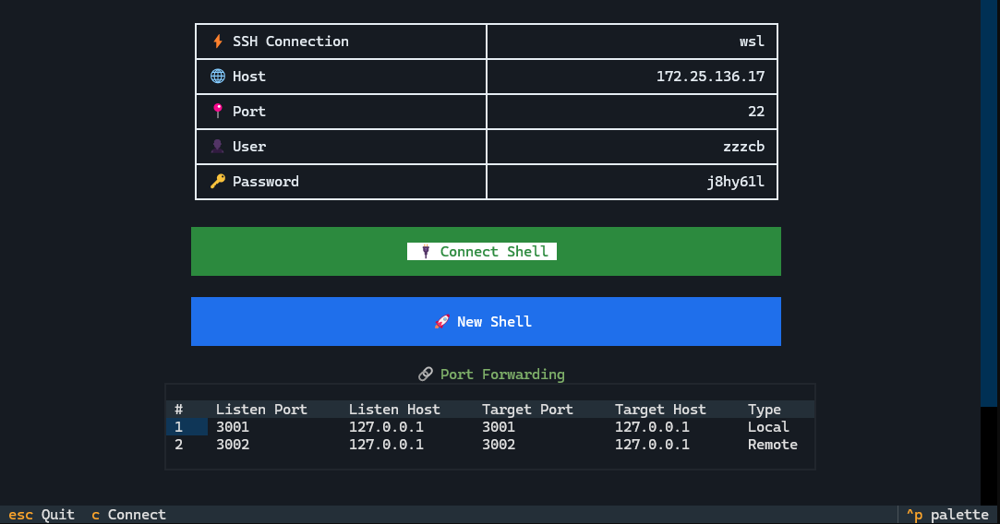

# SSH Manager

SSH Manager is an easy-to-use SSH connection management tool that helps you efficiently manage and use multiple SSH connections.

## Features

### Manage SSH Configs




### Manage SSH Connection




## Quick Start

### System Requirements

- **Python**: 3.10 or higher
- **Operating System**: Linux, Windows
- **Tested on**: Ubuntu 22.04, Windows 11

### Install

```bash
pip install git+https://github.com/zjxszzzcb/ssh-manager.git@dev
```

### Initialize from ~/.ssh/config

```
mssh init
```

### Run SSH Manager TUI

```
# run tui directly
mssh
# run tui with ssh command
mssh ssh {user}@{hostname} {args}...
```

### Configure `~/.ssh/config`

```
mssh config
```
